# Intelligent Image Classification and Analysis

[](https://image-analyserbyabhinandpv.streamlit.app/)

I built this project because I wanted to explore what's possible when you combine a solid vision model with a simple, clean interface. The idea was straightforward — drop in an image and get something genuinely useful back, whether that's a description, structured data pulled from a document, or a technical read on a stock chart. It's powered by Gemini 2.5 Flash under the hood and built with Streamlit to keep things accessible.

## 🚀 Live Demo

The app is deployed and ready to use — no setup required:
👉 **[https://image-analyserbyabhinandpv.streamlit.app/](https://image-analyserbyabhinandpv.streamlit.app/)**

## What It Does

- **Image Description**: Upload any image and get a detailed breakdown of what's in it — objects, people, setting, mood, visible text, all of it.
- **Structured Data Extraction**: Point it at a receipt or a document and it pulls out the relevant fields and returns them as clean JSON. No manual typing, no reformatting.
- **Stock Chart Analysis**: Upload a chart and the app reads it like a technical analyst would — trend direction, chart patterns, key support and resistance levels, and a summary of what the indicators suggest.

## How I Built It

- **Python 3**: The backbone of the whole thing.
- **Streamlit**: Kept the interface simple and interactive without needing a full frontend setup.
- **Google GenAI SDK**: Handles communication with the Gemini 2.5 Flash model for all the analysis.

## Getting Started

To get this running on your own machine, you'll need Python 3.8 or higher and a Google Gemini API key.

1. **Clone the project:**
   ```bash
   git clone https://github.com/Abhinand-PV/image-analyser.git
   cd image-analyser
   ```

2. **Set up a virtual environment (recommended):**
   ```bash
   python -m venv .venv
   source .venv/bin/activate  # If you're on Windows, use: .venv\Scripts\activate
   ```

3. **Install the required packages:**
   ```bash
   pip install -r requirements.txt
   ```

4. **Add your API Key:**
   Create a `.streamlit/secrets.toml` file in the main folder and add your Gemini API key like this:
   ```toml
   GEMINI_API_KEY = "your-api-key-here"
   ```

## Running the App

Just run this command in your terminal:
```bash
streamlit run app.py
```

Your browser should automatically open to `http://localhost:8501`. From there, use the sidebar to pick what you want to do, upload your image, and let the app handle the rest!

## See It in Action

*(Note: The images below use standard Markdown formatting to render as actual pictures on GitHub!)*

### 1. The Main Interface
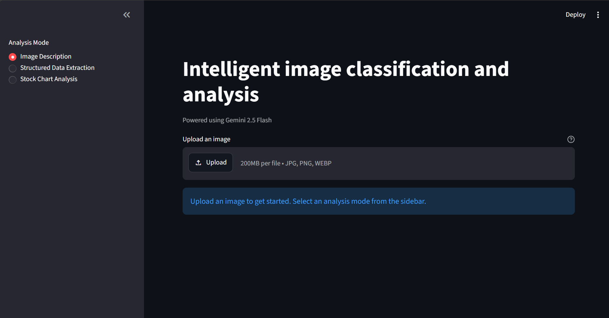

### 2. Image Description in Action
See how the model breaks down the visual elements of a document into a comprehensive textual description:

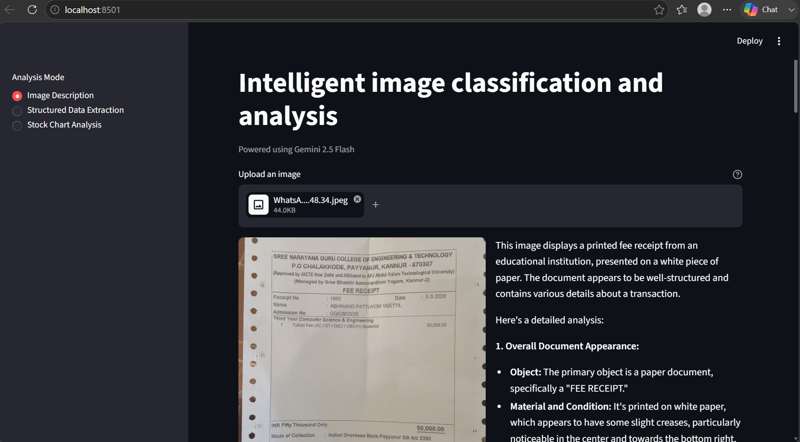
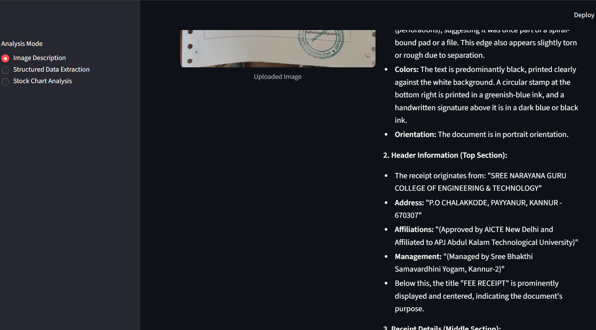
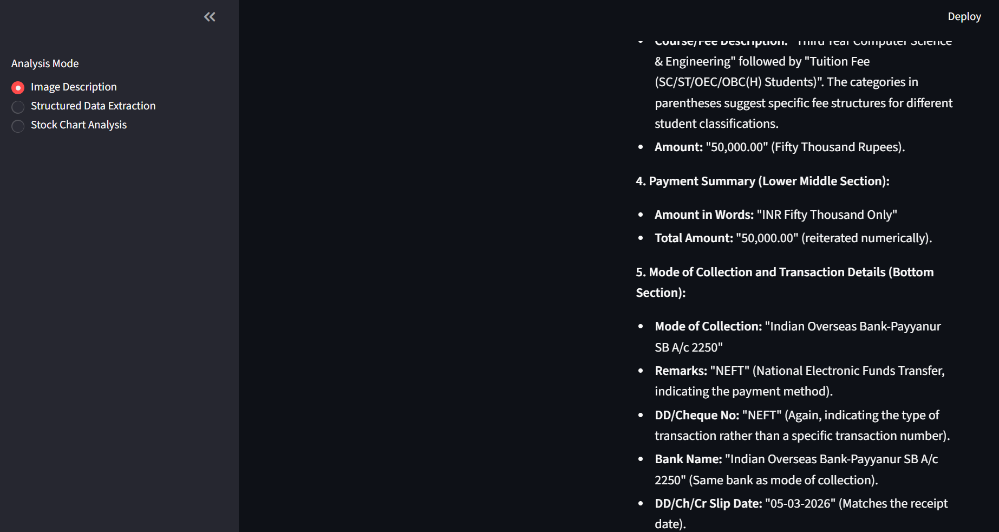
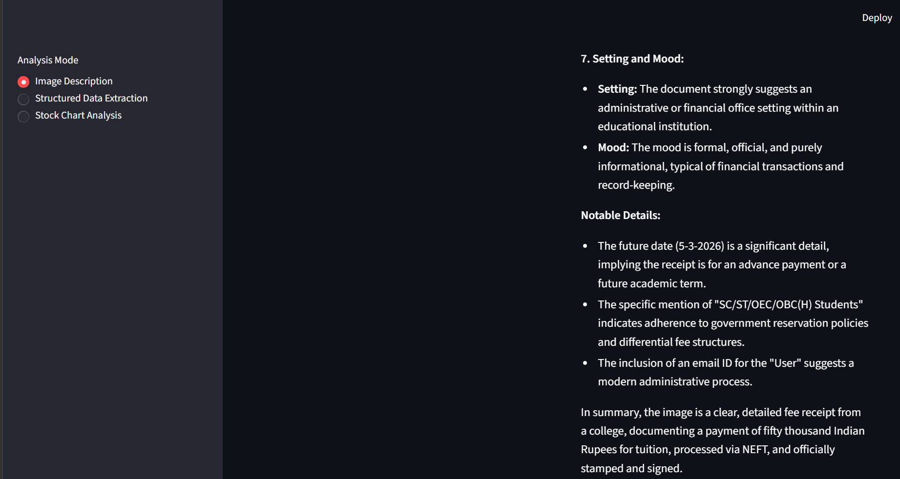

### 3. Extracting Data from Documents
Watch as the tool pulls structured JSON data directly from a scanned fee receipt:

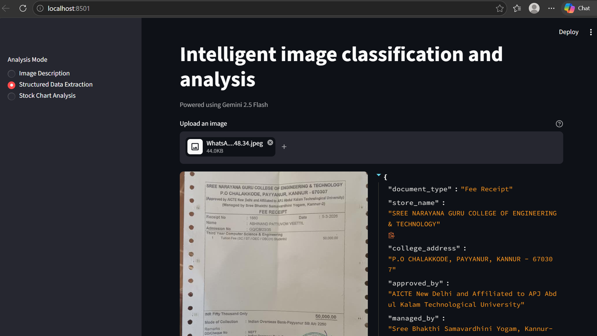
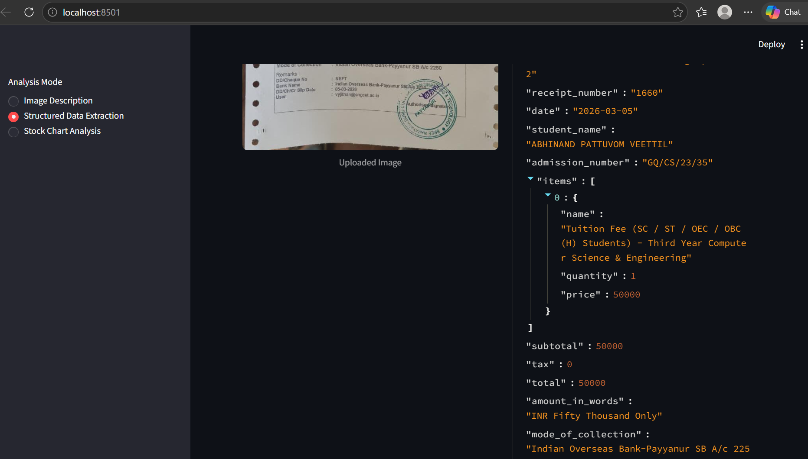
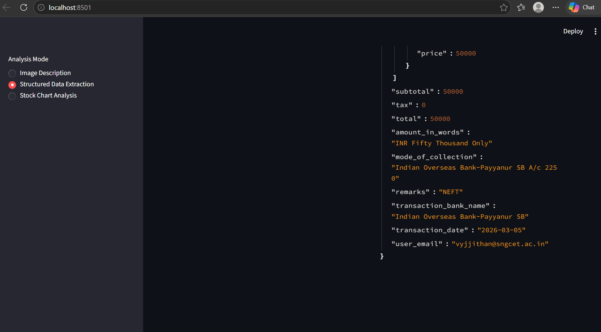

### 4. Deep Dive: Stock Chart Analysis

Here is a step-by-step look at how the app breaks down a financial chart. It identifies the overall bearish trend, points out the key resistance levels, and provides a final outlook based on the indicators it sees.

*Uploading the Chart & Trend Analysis*
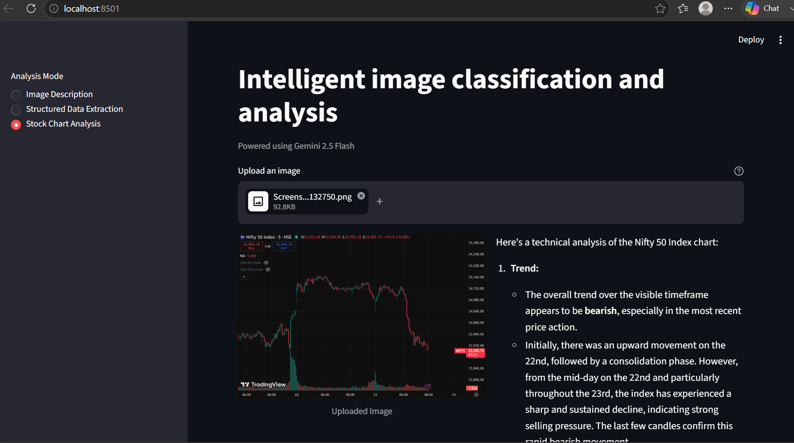

*Identifying Key Resistance & Support Levels*
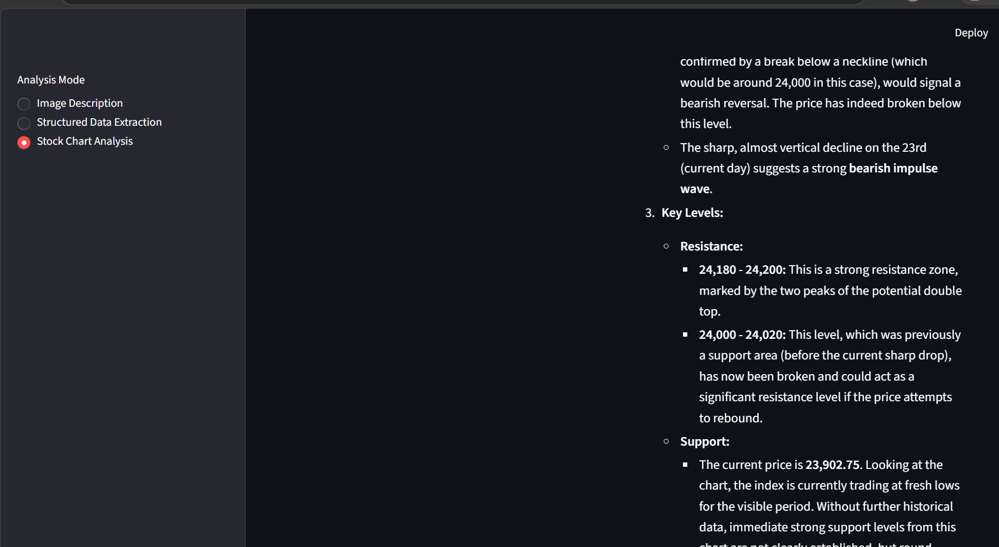

*Interpreting Indicators and Final Summary*
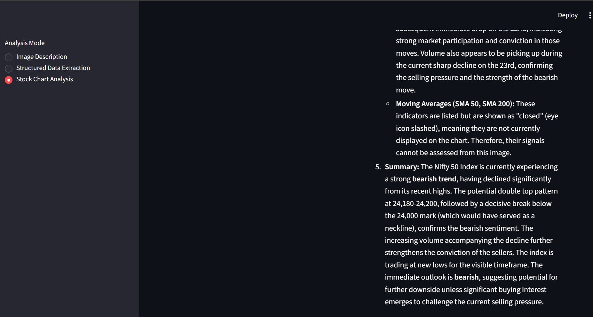
